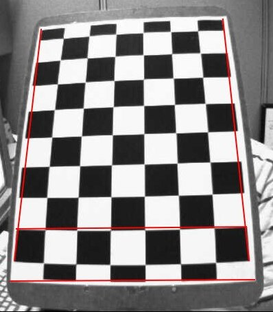
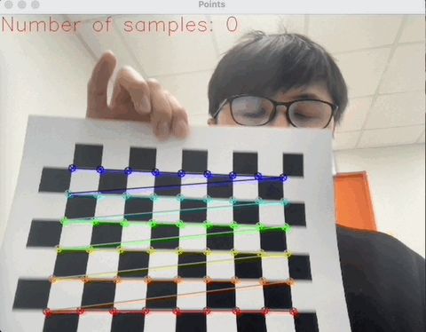

> بِسْمِ اللهِ الرَّحْمٰنِ الرَّحِيْمِ

# Camera Calibration
Calibration is the first step in any computer vision project. 
Calibration helps to measure the distortion to images.

There are two kinds of distortion: Radial distortion and tangential distortion. More in [docs.opencv](https://docs.opencv.org/3.4/dc/dbb/tutorial_py_calibration.html)

#### What is "distortion"?

According to [wikipedia](https://en.wikipedia.org/wiki/Distortion_%28optics%29), in geometric optics, *distortion* is a deviation from rectilinear projection. The word "deviation" means anything that differ from the usual, expected or accepted standards.  In order to understand it straightforward, map the word "deviation" to statistical word "standard deviation".  Standard deviation is correct or expected path, while deviation is path, which is not align with standard one (standard deviation).

Rectilinear projection is projection in which straight lines in a scene remain straight in an image. In other words, healthy (normal) camera will follow rectilinear projection, while ill camera follows uncertain path (deviation), which is not expected. 

## Installation
1. Install `opencv-python`, `numpy` packages.
2. Print out the [patter.png](pattern.png).
3. Run `python main.py -camera_index=0`.
4. Show the printed image to the camera. Press 's' to save the frames. It is recommended to have 14 frames. Press 'c' to update the frame.
5. After collecting frames 14 frames, press "q" to close the opencv window and calculate the calibration and save the results under the file name `calib_cam{camera_index}.pkl`.
6. See the calibration result and error in the terminal.

## DEMO

## Acknowledgments
- https://docs.opencv.org/3.4/dc/dbb/tutorial_py_calibration.html
- https://github.com/georgesung/advanced_lane_detection/tree/master
- https://github.com/NVlabs/few_shot_gaze/tree/master
